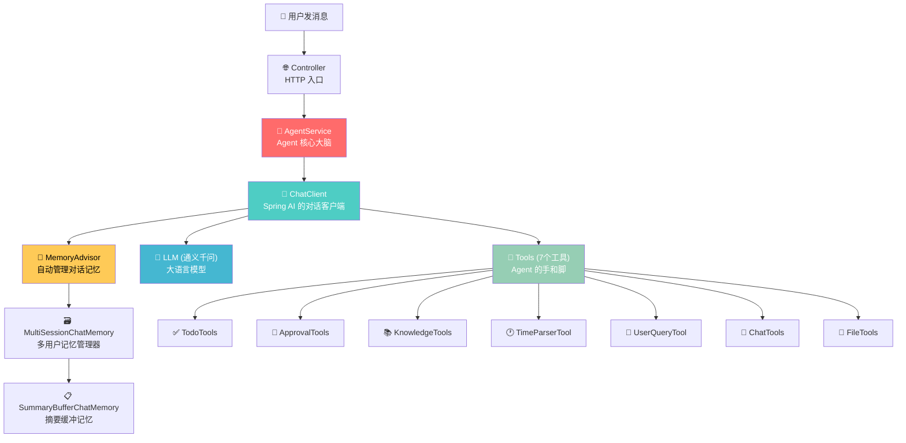
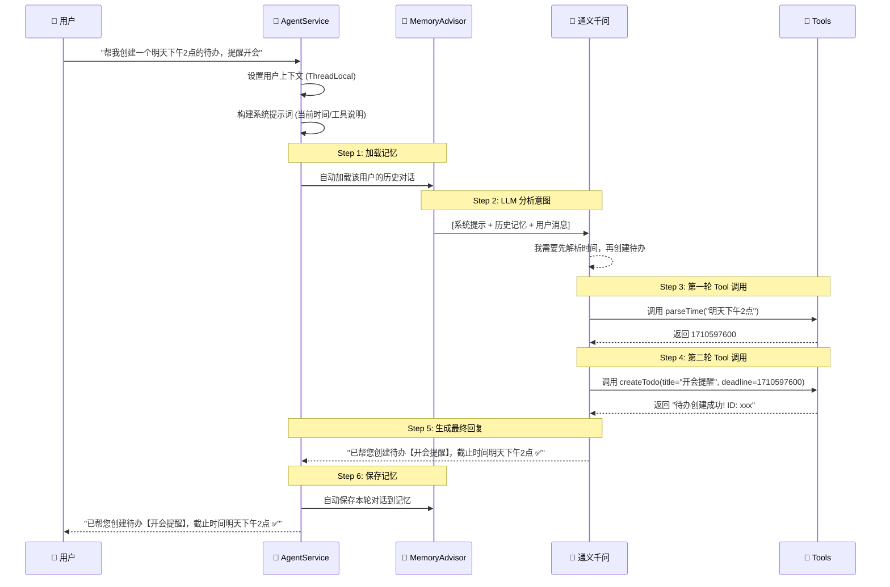
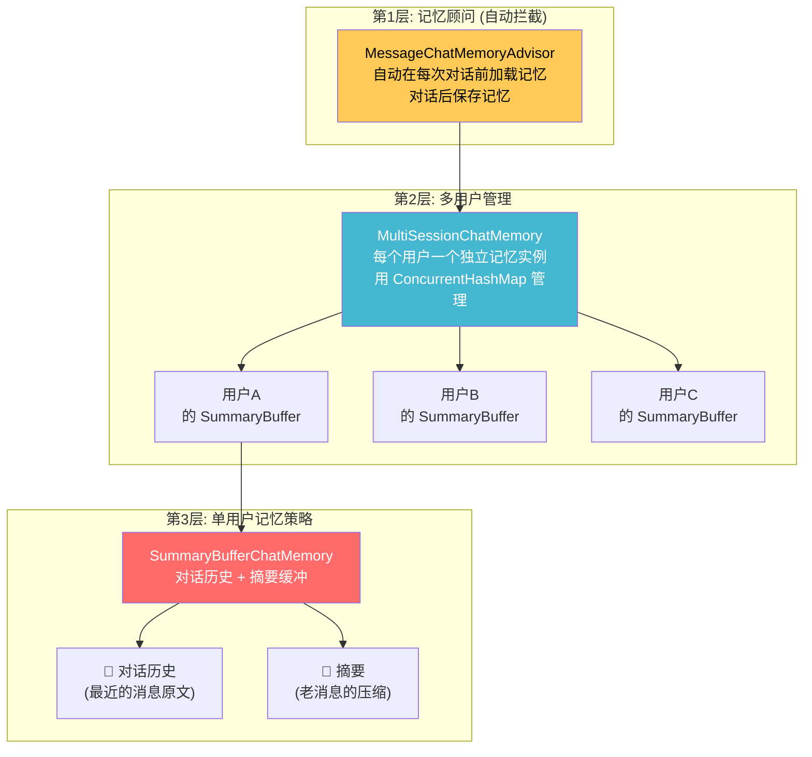
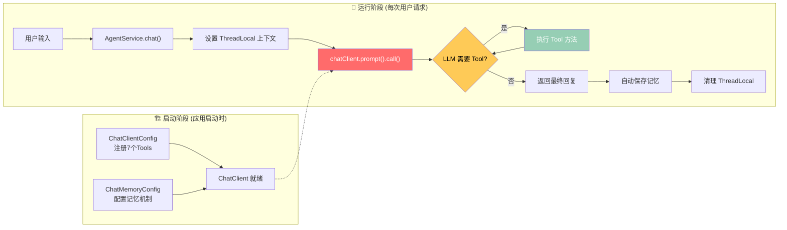

# 🤖 从零理解 Agent：以 AIWorkHelper-Java 为例

## 先用一个类比理解 Agent

> 想象你新入职一家公司，公司给你配了一个**超级秘书**。
>
> - 你说「帮我请个假」，秘书会**理解你的意图**（请假），**选对工具**（打开审批系统），**填好表单**，然后告诉你「搞定了」。
> - 如果你之前跟秘书说过「我叫小明」，下次你说「帮我请假」，秘书**还记得你是小明**，不需要再问。
>
> **这个秘书就是 Agent。** 而这个项目里的 Agent，就是用代码实现了这样一个秘书。

---

## 一、Agent 的整体架构

### 架构全景图



### 关键文件一览

| 文件 | 角色 | 类比 |
|------|------|------|
| [AgentService.java](file:///Users/momo/Code/Java/AIWorkHelper-Java/src/main/java/com/aiwork/helper/ai/agent/AgentService.java) | Agent 大脑入口 | 秘书本人 |
| [ChatClientConfig.java](file:///Users/momo/Code/Java/AIWorkHelper-Java/src/main/java/com/aiwork/helper/ai/config/ChatClientConfig.java) | 组装 Agent（注册工具+记忆） | 给秘书配齐装备 |
| [ChatMemoryConfig.java](file:///Users/momo/Code/Java/AIWorkHelper-Java/src/main/java/com/aiwork/helper/ai/config/ChatMemoryConfig.java) | 配置记忆机制 | 给秘书一个笔记本 |
| [TodoTools.java](file:///Users/momo/Code/Java/AIWorkHelper-Java/src/main/java/com/aiwork/helper/ai/tools/TodoTools.java) 等 7 个 Tools | 具体工具实现 | 秘书桌上的7种工具 |
| [SummaryBufferChatMemory.java](file:///Users/momo/Code/Java/AIWorkHelper-Java/src/main/java/com/aiwork/helper/ai/memory/SummaryBufferChatMemory.java) | 摘要缓冲记忆 | 秘书的速记笔记本 |
| [MultiSessionChatMemory.java](file:///Users/momo/Code/Java/AIWorkHelper-Java/src/main/java/com/aiwork/helper/ai/memory/MultiSessionChatMemory.java) | 多用户记忆管理 | 给每个人一本独立笔记本 |

---

## 二、核心循环 —— Agent 如何"思考"

### Agent 的一次完整工作流

当你说 **「帮我创建一个明天下午2点的待办，提醒开会」** 时，内部发生了什么：



### 对应代码：Agent 入口

> [AgentService.java](file:///Users/momo/Code/Java/AIWorkHelper-Java/src/main/java/com/aiwork/helper/ai/agent/AgentService.java)

```java
// 这是 Agent 的"大脑"入口，对应上面时序图的 AgentService
public String chat(String userId, String userInput, ...) {
    try {
        // Step 0: 设置上下文（告诉工具"当前是谁在操作"）
        TodoTools.setCurrentUserId(userId);
        ChatTools.setChatContext(relationId, startTime, endTime);

        // Step 1-6: 一行代码完成整个 Agent 循环！
        String response = chatClient.prompt()
                .system(buildSystemPrompt())     // 系统提示词（角色设定）
                .user(userInput)                 // 用户的话
                .advisors(advisorSpec -> advisorSpec
                    .param("chat_memory_conversation_id", userId))  // 记忆隔离
                .call()                          // 🔥 执行！（LLM推理 + Tool调用 全在这里）
                .content();                      // 获取最终文本

        return response;
    } finally {
        // 清理上下文
        TodoTools.clearCurrentUserId();
        ChatTools.clearChatContext();
    }
}
```

> [!IMPORTANT]
> **核心循环藏在 `.call()` 里面！** Spring AI 的 `ChatClient` 内部实现了完整的 Agent 循环：
> 1. 把消息发给 LLM
> 2. 如果 LLM 决定调用 Tool → 执行 Tool → 把结果再给 LLM
> 3. LLM 可能继续调用更多 Tool（多轮循环）
> 4. 直到 LLM 认为可以给出最终答案 → 返回文本
>
> 你不需要手写循环，Spring AI 框架帮你做了。这就像你请了一个秘书，你只需要说一句话，秘书自己会拆分步骤、选工具、执行、给你结果。

---

## 三、Tool/工具调用 —— Agent 怎么知道有哪些工具？

### 3.1 工具是怎么定义的？

每个 Tool 就是一个普通的 Java 方法，加上 `@Tool` 注解。**注解里的 `description` 是关键——LLM 就是靠这段文字来理解工具用途的。**

> [TodoTools.java](file:///Users/momo/Code/Java/AIWorkHelper-Java/src/main/java/com/aiwork/helper/ai/tools/TodoTools.java#L66-L71)

```java
@Tool(description = "创建待办事项。当用户想要创建、添加新的待办任务时使用。")
public String createTodo(
        @ToolParam(description = "待办标题，必填") String title,
        @ToolParam(description = "待办描述，必填") String desc,
        @ToolParam(description = "截止时间，Unix时间戳(秒)，必填") Long deadlineAt,
        @ToolParam(description = "执行人用户名列表，可选") List<String> executorNames
) {
    // ... 实际的业务逻辑：调用 TodoService 创建待办
}
```

> 类比：`@Tool` 的 `description` 就像是工具上贴的**标签**。秘书看到标签写着「创建待办：当需要添加任务时用这个」，就知道什么时候该用这个工具。`@ToolParam` 则是告诉秘书「使用这个工具需要填哪些信息」。

### 3.2 工具是怎么注册的？

所有工具在 `ChatClientConfig` 里一次性注册给 ChatClient：

> [ChatClientConfig.java](file:///Users/momo/Code/Java/AIWorkHelper-Java/src/main/java/com/aiwork/helper/ai/config/ChatClientConfig.java#L55-L66)

```java
ChatClient client = ChatClient.builder(chatModel)
        .defaultTools(          // 👈 在这里注册所有工具！
                todoTools,      // ✅ 待办工具
                approvalTools,  // 📑 审批工具
                knowledgeTools, // 📚 知识库工具
                timeParserTool, // 🕐 时间解析
                userQueryTool,  // 👤 用户查询
                chatTools,      // 💬 聊天记录
                fileTools       // 📁 文件工具
        )
        .defaultAdvisors(messageChatMemoryAdvisor)  // 📝 记忆顾问
        .build();
```

> 类比：这就是**给秘书发工具包的过程**。你在秘书入职的时候（应用启动），就把一整套工具（7个）和一本笔记本（记忆 Advisor）交给了秘书。

### 3.3 工具调用的完整链路

```
用户说话 → LLM 看到系统提示里列出的工具清单
         → LLM 根据 @Tool 的 description 选择合适的工具
         → Spring AI 自动调用对应的 Java 方法
         → 方法返回字符串结果
         → 结果返回给 LLM 继续推理
```

### 3.4 所有工具一览

| 工具类 | 方法 | 功能 | 什么时候被LLM选中 |
|--------|------|------|------------------|
| **TodoTools** | `createTodo` | 创建待办 | 用户说「帮我建个待办」 |
| | `findTodos` | 查询待办 | 用户说「我有什么待办？」 |
| **ApprovalTools** | `createLeaveApproval` | 请假审批 | 用户说「帮我请个假」 |
| | `createPunchApproval` | 补卡审批 | 用户说「帮我补个卡」 |
| | `createGoOutApproval` | 外出审批 | 用户说「申请外出」 |
| | `findApprovals` | 查询审批 | 用户说「查一下我的审批」 |
| **KnowledgeTools** | `queryKnowledge` | 知识库问答 | 用户问「年假有几天？」 |
| | `updateKnowledge` | 更新知识库 | 用户说「用PDF更新知识库」 |
| | `clearKnowledge` | 清空知识库 | 用户说「清空知识库」 |
| **TimeParserTool** | `parseTime` | 自然语言→时间戳 | LLM 需要把「明天下午3点」变成数字 |
| | `getCurrentTime` | 获取当前时间 | LLM 需要知道"现在几点" |
| **UserQueryTool** | `getUserIdByName` | 用户名→ID | LLM 需要把「小明」变成用户ID |
| **ChatTools** | `getChatLogs` | 获取聊天记录 | 用户说「看看群聊记录」 |
| | `summarizeChatLogs` | 总结群聊 | 用户说「总结一下群聊」 |
| **FileTools** | `getRecentUploadedFiles` | 获取文件列表 | 用户说「我上传了什么文件？」 |
| | `getLatestUploadedFilePath` | 最近上传的文件路径 | 更新知识库时自动调用 |

---

## 四、记忆与上下文管理 —— Agent 怎么"记住"你

### 4.1 记忆架构（三层结构）



### 4.2 SummaryBufferChatMemory 工作原理

> 类比：秘书的笔记本只有20页。当记满了，秘书不会扔掉笔记本，而是先把前面的内容**总结成一段话**写在第一行，再清空其它页继续记。

> [SummaryBufferChatMemory.java](file:///Users/momo/Code/Java/AIWorkHelper-Java/src/main/java/com/aiwork/helper/ai/memory/SummaryBufferChatMemory.java#L79-L95)

```java
// 每次对话后都会被调用
public void add(String conversationId, List<Message> messages) {
    // 1. 把新消息加入历史
    List<Message> history = conversationHistory
        .computeIfAbsent(conversationId, k -> new ArrayList<>());
    history.addAll(messages);

    // 2. 估算 Token 数量
    int tokenCount = estimateTokenCount(conversationId);

    // 3. 🔥 如果超限，自动生成摘要！
    if (tokenCount > maxTokenLimit) {
        generateSummary(conversationId);
        // generateSummary 会：
        //   a) 调用 LLM 把所有历史浓缩成一段摘要
        //   b) 保存摘要到 summaryBuffer
        //   c) 清空对话历史（因为关键信息已在摘要里了）
    }
}
```

**读取记忆时**（每次对话前）：

> [SummaryBufferChatMemory.java](file:///Users/momo/Code/Java/AIWorkHelper-Java/src/main/java/com/aiwork/helper/ai/memory/SummaryBufferChatMemory.java#L97-L118)

```java
public List<Message> get(String conversationId, int lastN) {
    List<Message> result = new ArrayList<>();

    // 1. 先放摘要（浓缩的"老记忆"）
    String summary = summaryBuffer.get(conversationId);
    if (summary != null && !summary.isEmpty()) {
        result.add(new SystemMessage("之前的对话摘要: " + summary));
    }

    // 2. 再放最近的原始对话（"新记忆"）
    List<Message> history = conversationHistory.get(conversationId);
    if (history != null) {
        int startIndex = Math.max(0, history.size() - lastN);
        result.addAll(history.subList(startIndex, history.size()));
    }

    return result;  // [摘要] + [最近N条对话] → 发给 LLM
}
```

> [!TIP]
> **为什么不直接保留所有对话？** 因为 LLM 有 Token 上下文窗口限制，而且 Token 越多越贵、越慢。摘要缓冲是一个 **成本和记忆质量的平衡方案**。

### 4.3 ThreadLocal 上下文传递

除了对话记忆外，Agent 还需要知道「当前是谁在操作」。这是通过 `ThreadLocal` 实现的：

```java
// AgentService.chat() 开头 → 设置
TodoTools.setCurrentUserId(userId);        // 告诉工具"现在是张三在用"
ChatTools.setChatContext(relationId, ...); // 告诉工具"当前聊天上下文"

// ... Agent 工作中，Tools 可以读取 ...
String userId = TodoTools.getCurrentUserId();  // "哦，是张三啊"

// AgentService.chat() 结尾 → 清理
TodoTools.clearCurrentUserId();
ChatTools.clearChatContext();
```

> 类比：这就像秘书在处理你的事务之前，先在桌上摆一个「当前服务对象：张三」的牌子，工具都能看到这个牌子。事情办完了，牌子收走。

---

## 五、终止条件 —— Agent 什么时候停下来？

在这个项目中，Agent 的循环由 Spring AI 框架的 `ChatClient.call()` 内部管理，终止条件是：

### ✅ 正常终止

**LLM 不再请求调用 Tool 时**，Agent 循环自动结束。

```
用户: "帮我请个明天的病假"
  → LLM 思考: 需要先解析时间 → 调用 parseTime("明天") → 拿到时间戳
  → LLM 思考: 还需要创建审批 → 调用 createLeaveApproval(...) → 审批创建成功
  → LLM 思考: 任务完成了，我可以回复用户了 ← 🔴 这就是终止点！
  → LLM 输出: "已帮您提交明天的病假申请 ✅"
```

具体来说，Spring AI 的 Function Calling 协议是这样工作的：

```
┌─────────────────────────────────────────────┐
│  chatClient.call() 内部循环                  │
│                                              │
│  while (true) {                              │
│    response = LLM.generate(messages)         │
│                                              │
│    if (response 包含 tool_call) {             │
│      result = 执行对应的 Java 方法             │
│      messages.add(tool_result)               │
│      continue; // 继续循环 ↩️                 │
│    } else {                                  │
│      return response.text; // 🔴 终止！       │
│    }                                         │
│  }                                           │
└─────────────────────────────────────────────┘
```

### ❌ 异常终止

```java
// AgentService.java 第85-88行
} catch (Exception e) {
    log.error("Agent处理失败: userId={}, input={}", userId, userInput, e);
    return "抱歉，处理请求时发生错误: " + e.getMessage();
}
```

如果 LLM 调用、Tool 执行、网络请求等任何环节出错，Agent 会立即终止并返回错误信息。

---

## 六、系统提示词 —— Agent 的"工作手册"

系统提示词是 Agent 的**行为指南**，定义在 [AgentService.buildSystemPrompt()](file:///Users/momo/Code/Java/AIWorkHelper-Java/src/main/java/com/aiwork/helper/ai/agent/AgentService.java#L98-L178) 中，包含：

| 内容 | 作用 |
|------|------|
| `"你是一个智能工作助手"` | 角色设定 |
| 当前时间 + 时间戳 | 帮LLM理解"现在是什么时候" |
| 时间计算规则 + 示例 | 教LLM如何计算时间戳 |
| 工具清单和用途 | LLM知道自己能做什么 |
| 工作流程 | 先解析时间 → 再查用户 → 再办事 |
| 特殊场景处理 | 边界case的处理指引 |
| 注意事项 | 请假类型映射、默认值等 |

> 类比：这就是你给新秘书的**入职培训手册**，告诉他公司环境、工作规范和注意事项。

---

## 七、总结：一张图回顾



### 核心要点

1. **Agent = LLM + Tools + Memory**，三者缺一不可
2. 这个项目用 **Spring AI 的 Function Calling** 实现 Agent，核心循环在框架内部
3. 工具通过 **`@Tool` 注解**定义，通过 **`ChatClient.defaultTools()`** 注册
4. 记忆用 **SummaryBuffer 策略**：原文 + 摘要结合，平衡成本和质量
5. Agent 在 **LLM 不再请求 Tool 调用时**自动终止
